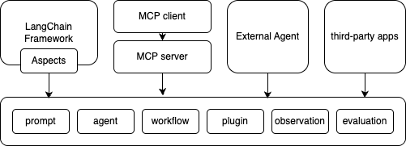

# 关于 HiAgent-SDK

[English](README.md) | 中文README

HiAgent-SDK是火山引擎的HiAgent产品的SDK，开发者可使用该SDK，快捷的开发功能，提升开发效率。HiAgent-SDK提供了完整的AI原生应用开发套件，包括丰富的开发组件和应用示例代码。

## 架构



## 快速开始

```go
package main

import (
	"context"
	"crypto/sha256"
	"encoding/hex"
	"fmt"
	"io"
	"log"
	"os"
	"strings"

	"github.com/google/uuid"
	"github.com/volcengine/hiagent-go-sdk/service/up"
)

func calculateSHA256(filePath string) (string, error) {
	file, err := os.Open(filePath)
	if err != nil {
		return "", err
	}
	defer file.Close()

	hash := sha256.New()
	if _, err := io.Copy(hash, file); err != nil {
		return "", err
	}

	return hex.EncodeToString(hash.Sum(nil)), nil
}

func main() {
	ctx := context.Background()

	// 从环境变量获取凭证
	ak := os.Getenv("VOLC_ACCESSKEY")
	sk := os.Getenv("VOLC_SECRETKEY")
	uploadEndpoint := os.Getenv("HIAGENT_UP_UPLOAD_ENDPOINT")

	// 创建上传客户端
	client := up.New(uploadEndpoint, ak, sk)

	// 1. 打开要上传的文件
	testFile, err := os.Open("example.txt")
	if err != nil {
		log.Fatalf("Failed to open file: %v", err)
	}
	defer testFile.Close()

	// 计算文件哈希
	fileHash, err := calculateSHA256("example.txt")
	if err != nil {
		log.Fatalf("Failed to calculate SHA256: %v", err)
	}

	// 2. 上传文件
	uploadReq := up.UploadRawRequest{
		ID:          strings.ReplaceAll(uuid.New().String(), "-", ""),
		ContentType: "text/plain",
		Expire:      "15h",
		Sha256:      fileHash,
	}

	uploadResp, err := client.UploadRaw(ctx, uploadReq, testFile)
	if err != nil {
		log.Fatalf("Upload failed: %v", err)
	}
	fmt.Printf("上传成功。路径: %s, 大小: %d\n", uploadResp.Path, uploadResp.Size)

	// 3. 获取下载密钥
	downloadKeyResp, err := client.DownloadKey(ctx, uploadResp.Path)
	if err != nil {
		log.Fatalf("Get download key failed: %v", err)
	}
	fmt.Printf("下载密钥: %s\n", downloadKeyResp.Key)

	// 4. 下载文件
	downloadBody, err := client.Download(ctx, uploadResp.Path, downloadKeyResp.Key)
	if err != nil {
		log.Fatalf("Download failed: %v", err)
	}

	// 保存下载的文件
	saveFile, err := os.Create("downloaded.txt")
	if err != nil {
		log.Fatalf("Failed to create save file: %v", err)
	}
	defer saveFile.Close()

	_, err = io.Copy(saveFile, downloadBody)
	if err != nil {
		log.Fatalf("Failed to save downloaded file: %v", err)
	}
	fmt.Println("文件下载成功，保存至 downloaded.txt")

	// 5. 删除文件
	deleteReq := up.DeleteRequest{
		ID:     uploadReq.ID,
		Sha256: fileHash,
	}

	err = client.Delete(ctx, deleteReq)
	if err != nil {
		log.Fatalf("Delete failed: %v", err)
	}
	fmt.Println("文件删除成功")
}
```

## License

该项目采用 [Apache-2.0 License](LICENSE) 许可。
